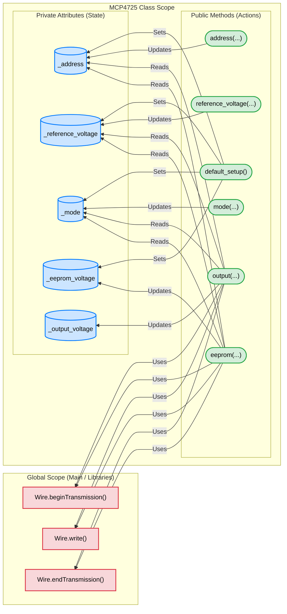

# MCP4725 light and simple library

```mermaid
flowchart RL
    %% Styling
    classDef method fill:#d4edda,stroke:#28a745,stroke-width:2px,color:black;
    classDef attribute fill:#cce5ff,stroke:#007bff,stroke-width:2px,color:black;
    classDef globalFunc fill:#f8d7da,stroke:#dc3545,stroke-width:2px,color:black;

    subgraph MCP4725 ["MCP4725 Class Scope"]
        
        subgraph Attributes ["Private Attributes (State)"]
            direction TB
            a_addr[("_address")]:::attribute
            a_ref[("_reference_voltage")]:::attribute
            a_mode[("_mode")]:::attribute
            a_eep[("_eeprom_voltage")]:::attribute
            a_out[("_output_voltage")]:::attribute
        end
        subgraph Methods ["Public Methods (Actions)"]
            direction TB
            m_setup(["default_setup()"]):::method
            m_addr(["address(...)"]):::method
            m_ref(["reference_voltage(...)"]):::method
            m_mode(["mode(...)"]):::method
            m_eeprom(["eeprom(...)"]):::method
            m_out(["output(...)"]):::method
        end

        
    end

    subgraph External ["Global Scope (Main / Libraries)"]
        direction TB
        w_begin["Wire.beginTransmission()"]:::globalFunc
        w_write["Wire.write()"]:::globalFunc
        w_end["Wire.endTransmission()"]:::globalFunc
    end

    %% Method to Attribute interactions
    m_setup -->|Sets| a_addr & a_ref & a_mode & a_eep
    m_addr -->|Updates| a_addr
    m_ref -->|Updates| a_ref
    m_mode -->|Updates| a_mode
    
    m_out -->|Reads| a_addr & a_mode & a_ref
    m_out -->|Updates| a_out
    
    m_eeprom -->|Reads| a_addr & a_mode & a_ref
    m_eeprom -->|Updates| a_eep

    %% Method to Global function interactions
    m_out -->|Uses| w_begin & w_write & w_end
    m_eeprom -->|Uses| w_begin & w_write & w_end
```